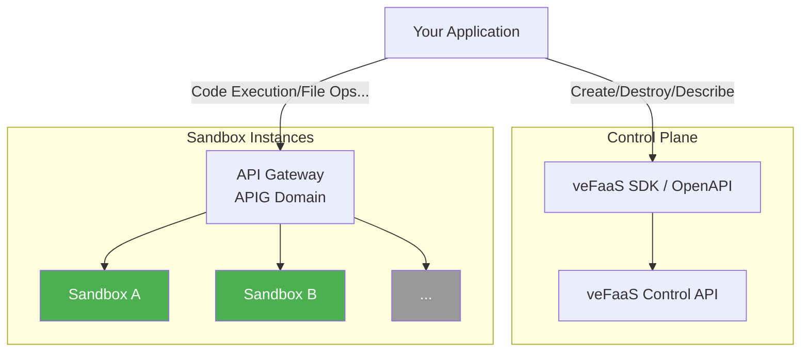
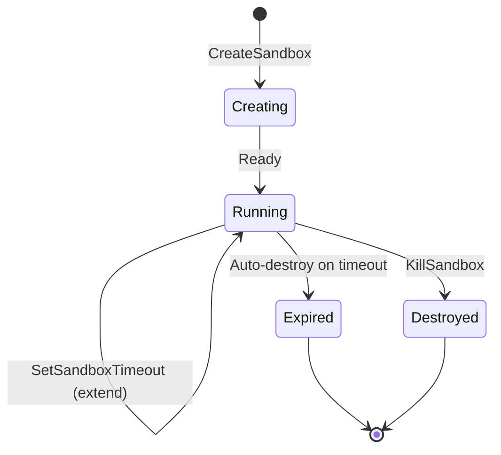

**English** | [中文](./README_zh.md)

# veFaaS Sandbox Cookbook

Sample code and integration guide for veFaaS Cloud Sandbox. Get started quickly with sandbox capabilities.

[Sandbox API Documentation](https://www.volcengine.com/docs/6662/1806654) · [veFaaS Console](https://console.volcengine.com/vefaas)

## Examples

### Quick Start

| Example | Python | Node.js |
|---------|--------|---------|
| Hello World | [hello-world-python](./examples/hello-world-python) | [hello-world-nodejs](./examples/hello-world-nodejs) |

### Sandbox Manager

| Example | Python | Node.js |
|---------|--------|---------|
| Sandbox lifecycle (create/describe/extend/destroy) | [sandbox-manager-python](./examples/sandbox-manager-python) | [sandbox-manager-nodejs](./examples/sandbox-manager-nodejs) |

### Code Sandbox

| Example | Python | Node.js |
|---------|--------|---------|
| Code execution (Python / Node.js / Shell) | [code-execute-python](./examples/code-execute-python) | [code-execute-nodejs](./examples/code-execute-nodejs) |
| File operations (read/write/list/download) | [code-file-ops-python](./examples/code-file-ops-python) | — |
| Package management (pip / npm) | [code-package-manager-python](./examples/code-package-manager-python) | — |
| WebSocket terminal | [websocket-terminal-python](./examples/websocket-terminal-python) | — |

### Demo

| Example | Python | Node.js |
|---------|--------|---------|
| AI Coding Assistant (LLM + Sandbox) | [ai-coding-assistant](./examples/ai-coding-assistant) | — |
| General-purpose AI Agent (Mastra + Sandbox) | — | [aio-agent-mastra](./examples/aio-agent-mastra) |

## 1. Overview

### What is Cloud Sandbox?

veFaaS Cloud Sandbox is a **secure, isolated cloud execution environment** provided by Volcengine Function Service (veFaaS). You can create and destroy sandbox instances on demand via OpenAPI / SDK. Each instance is a lightweight container with its own file system, network, and process space, supporting code execution, file I/O, package management, terminal interaction, and more. Typical use cases include:

- **AI Coding Assistants** — Provide a safe code execution and tool invocation environment for LLM / AI Agents
- **Online IDEs / Cloud Dev** — Ready-to-use cloud development environments
- **Code Evaluation & Competitions** — Isolated code execution and judging platforms
- **Browser Automation** — Web automation and data scraping via Browser Sandbox

> 📖 Official docs: [Cloud Sandbox Overview](https://www.volcengine.com/docs/6662/1802770) · [Sandbox Instances](https://www.volcengine.com/docs/6662/1802882)

### What is a Sandbox Image?

A Sandbox Image defines the runtime environment of a sandbox instance, including the operating system, pre-installed software, toolchains, and built-in APIs. You specify an image when creating a sandbox, and the image determines its available capabilities. veFaaS provides pre-warmed **public images** and also supports **custom images**.

#### Public Images

| Image Type | Description | Typical Use Cases |
|------------|-------------|-------------------|
| **All-in-One** | All-in-one runtime with integrated code execution, file management, terminal, and more | AI Agent multi-scenario tasks |
| **Code** | Pre-installed compilers and code editing tools for mainstream languages | Code compilation, execution, debugging |
| **Browser** | Built-in headless browser engine (Chromium) and control API | Web automation, data scraping, UI testing |
| **SWE-bench** | Standardized software engineering benchmark environment (invite-only) | Evaluate AI code repair capabilities |
| ... | | |

#### Custom Images

Custom images from Volcengine Container Registry (CR) are supported. Pre-warming enables sub-second startup.

> 📖 Official docs: [Sandbox Images](https://www.volcengine.com/docs/6662/1802883)

### Architecture



## 2. Prerequisites

### 2.1 Get Credentials

1. Sign up / log in to the [Volcengine Console](https://console.volcengine.com)
2. Get your [AccessKey / SecretKey](https://console.volcengine.com/iam/keymanage/)

### 2.2 Create a Sandbox Application

1. Go to the [veFaaS Console](https://console.volcengine.com/vefaas)
2. [Create a Sandbox application with the **Code** image](https://console.volcengine.com/vefaas/region:vefaas+cn-beijing/sandbox/create?imageGroup=Code&quickStart=true)
3. Note the `Function ID` and `Endpoint` (public domain in gateway route configuration)

### 2.3 Configure Environment Variables

Each example directory contains a `.env.template`. Copy and fill in your credentials:

```bash
cp .env.template .env
```

Edit the `.env` file:

```bash
VOLC_ACCESS_KEY=your_access_key_here
VOLC_SECRET_KEY=your_secret_key_here
VEFAAS_REGION=cn-beijing
SANDBOX_APP_ID=your_function_id_here
SANDBOX_ENDPOINT=https://your_apig_domain_here
```

### 2.4 Install Dependencies

Each example directory has a `requirements.txt` (Python) or `package.json` (Node.js):

#### Python

```bash
cd examples/<example_directory>
pip install -r requirements.txt
```

Core dependencies: `volcengine-python-sdk` (includes veFaaS SDK), `httpx`, `python-dotenv`

#### Node.js

```bash
cd examples/<example_directory>
npm install
```

Core dependencies: `@volcengine/openapi`, `dotenv`

## 3. Quick Start (5 Minutes)

Minimal flow: **Create sandbox → Execute code → Get result → Destroy sandbox**

#### Python (SDK)

```python
api = VEFAASApi(ApiClient(config))
resp = api.create_sandbox(CreateSandboxRequest(
    function_id=FUNCTION_ID, cpu_milli=500, memory_mb=1024,
    timeout=1800, timeout_unit="second",
))
sandbox_id = resp.sandbox_id

async with httpx.AsyncClient(headers={"x-faas-instance-name": sandbox_id}) as client:
    resp = await client.post(f"https://{APIG_DOMAIN}/v1/code/execute", json={
        "language": "python",
        "code": "print('Hello from veFaaS Sandbox!')",
    })
    print(resp.json()["data"]["stdout"])

api.kill_sandbox(KillSandboxRequest(function_id=FUNCTION_ID, sandbox_id=sandbox_id))
```

> Full code: [hello-world-python](./examples/hello-world-python)

#### Node.js (HTTP API)

```javascript
const service = new Service({ serviceName: "vefaas", ... });
const createResp = await service.fetchOpenAPI({
    Action: "CreateSandbox", Version: "2024-06-06", method: "POST",
    data: { FunctionId, CpuMilli: 500, MemoryMB: 1024, Timeout: 1800, TimeoutUnit: "second" },
});
const sandboxId = createResp.Result.SandboxId;

const resp = await fetch(`https://${APIG_DOMAIN}/v1/code/execute`, {
    method: "POST",
    headers: { "Content-Type": "application/json", "x-faas-instance-name": sandboxId },
    body: JSON.stringify({ language: "python", code: "print('Hello!')" }),
});
console.log((await resp.json()).data.stdout);

await service.fetchOpenAPI({ Action: "KillSandbox", data: { FunctionId, SandboxId: sandboxId }, ... });
```

> Full code: [hello-world-nodejs](./examples/hello-world-nodejs)

## 4. Best Practices

This section introduces sandbox lifecycle management and specific application scenario APIs:

*   **Sandbox Lifecycle** (Section 4.1): Managed via **veFaaS OpenAPI / SDK**.
*   **Sandbox Internal Capabilities** (Sections 4.2 ~ 4.5): The following API capabilities and examples are primarily based on the **All-in-One Sandbox** image. For detailed API documentation and advanced usage, please refer to the [All-in-One Sandbox Official Documentation](https://sandbox.agent-infra.com/).

### 4.1 Sandbox Lifecycle Management

The control API (OpenAPI / SDK) provides full sandbox lifecycle management, including creation, querying, extension, and destruction:



```python
api = VEFAASApi(ApiClient(config))

sandbox_id = api.create_sandbox(CreateSandboxRequest(...)).sandbox_id
info = api.describe_sandbox(DescribeSandboxRequest(function_id=fid, sandbox_id=sandbox_id))
sandboxes = api.list_sandboxes(ListSandboxesRequest(function_id=fid)).sandboxes
api.set_sandbox_timeout(SetSandboxTimeoutRequest(function_id=fid, sandbox_id=sandbox_id, timeout=60))
api.kill_sandbox(KillSandboxRequest(function_id=fid, sandbox_id=sandbox_id))
```

> Full code: [sandbox-manager-python](./examples/sandbox-manager-python) / [sandbox-manager-nodejs](./examples/sandbox-manager-nodejs)

**Key points**:
- Each sandbox has a default timeout and is auto-destroyed when expired
- Use `SetSandboxTimeout` to extend, avoiding interruptions
- Call `KillSandbox` on exit to release resources promptly

### 4.2 Code Execution

Supports Python and Node.js code execution:

```python
result = await client.post(f"{endpoint}/v1/code/execute", json={
    "language": "python",
    "code": "import json; print(json.dumps({'hello': 'world'}))",
    "timeout": 30,
})

result = await client.post(f"{endpoint}/v1/code/execute", json={
    "language": "nodejs",
    "code": "console.log(JSON.stringify({ hello: 'world' }))",
})

result = await client.post(f"{endpoint}/v1/shell/exec", json={
    "command": "ls -la /home/tiger",
    "timeout": 10,
})
```

> Full code: [code-execute-python](./examples/code-execute-python) / [code-execute-nodejs](./examples/code-execute-nodejs)

### 4.3 File Operations

```python
await client.post(f"{endpoint}/v1/file/write", json={
    "file": "/home/tiger/hello.txt", "content": "Hello World!",
})

result = await client.post(f"{endpoint}/v1/file/read", json={
    "file": "/home/tiger/hello.txt",
})

result = await client.post(f"{endpoint}/v1/file/list", json={
    "path": "/home/tiger", "recursive": False, "max_depth": 2,
})
```

> Full code: [code-file-ops-python](./examples/code-file-ops-python)

### 4.4 Package Management

```python
packages = await client.get(f"{endpoint}/v1/sandbox/packages/python")

await client.post(f"{endpoint}/v1/shell/exec", json={
    "command": "pip install cowsay",
    "timeout": 120,
})
```

> Full code: [code-package-manager-python](./examples/code-package-manager-python)

### 4.5 WebSocket Terminal

```python
ws_url = endpoint.replace("https://", "wss://").replace("http://", "ws://") + "/v1/shell/ws"
async with websockets.connect(ws_url, additional_headers={"x-faas-instance-name": sandbox_id}) as ws:
    await ws.send(json.dumps({"type": "input", "data": "echo Hello\n"}))
    while True:
        try:
            msg = json.loads(await asyncio.wait_for(ws.recv(), timeout=3))
        except asyncio.TimeoutError:
            break
        if msg["type"] == "output":
            print(msg["data"], end="")
        elif msg["type"] == "ping":
            await ws.send(json.dumps({"type": "pong", "timestamp": msg["data"]}))
```

> Full code: [websocket-terminal-python](./examples/websocket-terminal-python)
