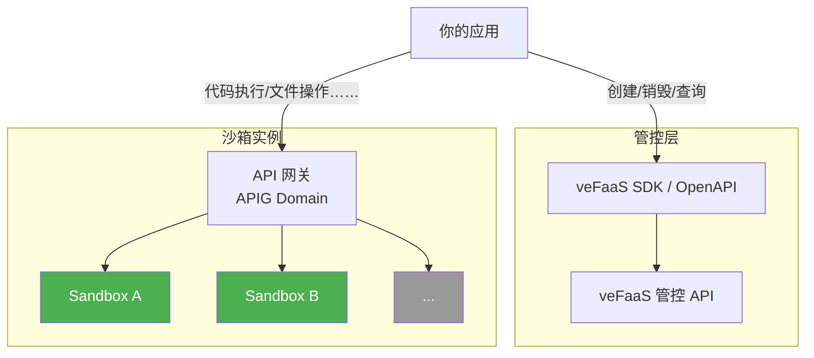
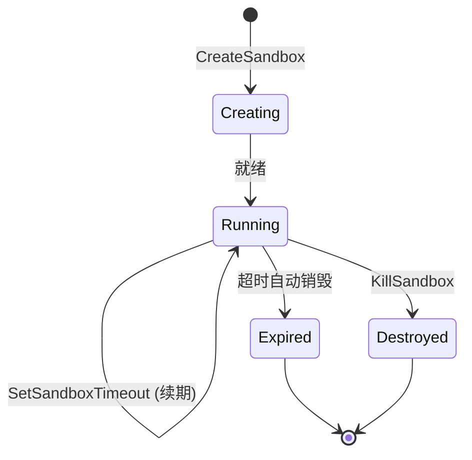

[English](./README.md) | **中文**

# veFaaS Sandbox Cookbook

veFaaS 云沙箱的示例代码和接入指南。帮助您快速理解和使用沙箱能力。

[云沙箱 API 文档](https://www.volcengine.com/docs/6662/1806654) · [veFaaS 控制台](https://console.volcengine.com/vefaas)

## 示例索引

### 快速开始

| 示例 | Python | Node.js |
|------|--------|---------|
| Hello World | [hello-world-python](./examples/hello-world-python) | [hello-world-nodejs](./examples/hello-world-nodejs) |

### Sandbox Manager

| 示例 | Python | Node.js |
|------|--------|---------|
| 沙箱生命周期管理（创建/查询/续期/销毁） | [sandbox-manager-python](./examples/sandbox-manager-python) | [sandbox-manager-nodejs](./examples/sandbox-manager-nodejs) |

### Code Sandbox

| 示例 | Python | Node.js |
|------|--------|---------|
| 代码执行（Python / Node.js / Shell） | [code-execute-python](./examples/code-execute-python) | [code-execute-nodejs](./examples/code-execute-nodejs) |
| 文件操作（读/写/列目录/下载） | [code-file-ops-python](./examples/code-file-ops-python) | — |
| 包管理（pip / npm） | [code-package-manager-python](./examples/code-package-manager-python) | — |
| WebSocket 终端 | [websocket-terminal-python](./examples/websocket-terminal-python) | — |

### 实战 Demo

| 示例 | Python | Node.js |
|------|--------|---------|
| AI 编程助手（LLM + Sandbox） | [ai-coding-assistant](./examples/ai-coding-assistant) | — |

## 1. 概述与核心概念

### 什么是云沙箱？

veFaaS 云沙箱是火山引擎函数服务（veFaaS）提供的**安全、隔离的云端执行环境**。你可以通过 OpenAPI / SDK 按需创建和销毁沙箱实例（Sandbox Instance），每个实例都是一个拥有独立文件系统、网络和进程空间的轻量级容器，支持代码执行、文件读写、包管理、终端交互等能力。典型应用场景包括：

- **AI 编程助手** — 为 LLM / AI Agent 提供安全的代码执行与工具调用环境
- **在线 IDE / Cloud Dev** — 即开即用的云端开发环境
- **代码评测与竞赛** — 安全隔离的代码运行与评判平台
- **浏览器自动化** — 基于 Browser Sandbox 的网页操控与数据爬取

> 📖 详见官方文档：[云沙箱概述](https://www.volcengine.com/docs/6662/1802770) · [沙箱实例](https://www.volcengine.com/docs/6662/1802882)

### 什么是沙箱镜像？

沙箱镜像定义了沙箱实例的运行环境，包括操作系统、预装软件、工具链和内置 API 等。创建沙箱时需要指定镜像，镜像决定了沙箱具备哪些能力。veFaaS 提供多种已预热的**公共镜像**，也支持用户上传**自定义镜像**。

#### 公共镜像

| 镜像类型 | 说明 | 典型场景 |
|----------|------|----------|
| **All-in-One** | 集成代码执行、文件管理、终端等多种工具的一站式运行环境 | AI Agent 多场景协同任务 |
| **Code** | 预装主流编程语言编译器与代码编辑工具 | 代码编译、运行、调试 |
| **Browser** | 内置无头浏览器引擎（Chromium）与操控 API | 网页自动化、数据爬取、UI 测试 |
| **SWE-bench** | 面向软件工程基准测试的标准化环境（邀测中） | 评估 AI 修复代码缺陷的能力 |
| ... | | |

#### 自定义镜像

支持使用火山引擎镜像仓库（CR）中的自定义镜像，预热后可实现秒级启动。

> 📖 详见官方文档：[沙箱镜像](https://www.volcengine.com/docs/6662/1802883)

### 架构简图



## 2. 准备工作

### 2.1 获取凭证

1. 注册/登录[火山引擎控制台](https://console.volcengine.com)
2. 获取 [AccessKey / SecretKey](https://console.volcengine.com/iam/keymanage/)

### 2.2 创建 Sandbox 应用

1. 进入 [veFaaS 控制台](https://console.volcengine.com/vefaas)
2. [以 **Code** 镜像创建云沙箱应用](https://console.volcengine.com/vefaas/region:vefaas+cn-beijing/sandbox/create?imageGroup=Code&quickStart=true)
3. 记录 `Function ID`（沙箱应用 ID） 和 `Endpoint`（沙箱网关路由配置内的公网访问域名）

### 2.3 配置环境变量

每个示例文件夹中都有 `.env.template`，复制并填入凭证即可：

```bash
cp .env.template .env
```

编辑 `.env` 文件，填入你的凭证：

```bash
VOLC_ACCESS_KEY=your_access_key_here
VOLC_SECRET_KEY=your_secret_key_here
VEFAAS_REGION=cn-beijing
SANDBOX_APP_ID=your_function_id_here
SANDBOX_ENDPOINT=https://your_apig_domain_here
```

### 2.4 安装依赖

每个示例目录下都有 `requirements.txt`（Python）或 `package.json`（Node.js），直接安装即可：

#### Python

```bash
cd examples/<示例目录>
pip install -r requirements.txt
```

核心依赖：`volcengine-python-sdk`（含 veFaaS SDK）、`httpx`、`python-dotenv`

#### Node.js

```bash
cd examples/<示例目录>
npm install
```

核心依赖：`@volcengine/openapi`、`dotenv`

## 3. 快速体验（5 分钟上手）

最简流程：**创建沙箱 → 执行代码 → 获取结果 → 销毁沙箱**

#### Python (SDK)

```python
api = VEFAASApi(ApiClient(config))
resp = api.create_sandbox(CreateSandboxRequest(
    function_id=FUNCTION_ID, cpu_milli=500, memory_mb=1024,
    timeout=1800, timeout_unit="second",
))
sandbox_id = resp.sandbox_id

async with httpx.AsyncClient(headers={"x-faas-instance-name": sandbox_id}) as client:
    resp = await client.post(f"https://{APIG_DOMAIN}/v1/code/execute", json={
        "language": "python",
        "code": "print('Hello from veFaaS Sandbox!')",
    })
    print(resp.json()["data"]["stdout"])

api.kill_sandbox(KillSandboxRequest(function_id=FUNCTION_ID, sandbox_id=sandbox_id))
```

> 完整代码: [hello-world-python](./examples/hello-world-python)

#### Node.js (HTTP API)

```javascript
const service = new Service({ serviceName: "vefaas", ... });
const createResp = await service.fetchOpenAPI({
    Action: "CreateSandbox", Version: "2024-06-06", method: "POST",
    data: { FunctionId, CpuMilli: 500, MemoryMB: 1024, Timeout: 1800, TimeoutUnit: "second" },
});
const sandboxId = createResp.Result.SandboxId;

const resp = await fetch(`https://${APIG_DOMAIN}/v1/code/execute`, {
    method: "POST",
    headers: { "Content-Type": "application/json", "x-faas-instance-name": sandboxId },
    body: JSON.stringify({ language: "python", code: "print('Hello!')" }),
});
console.log((await resp.json()).data.stdout);

await service.fetchOpenAPI({ Action: "KillSandbox", data: { FunctionId, SandboxId: sandboxId }, ... });
```

> 完整代码: [hello-world-nodejs](./examples/hello-world-nodejs)

## 4. 最佳实践

本节主要介绍沙箱生命周期管理和具体的应用场景 API：

*   **沙箱生命周期**（4.1 节）：通过 **veFaaS OpenAPI / SDK** 进行管控操作。
*   **沙箱内部能力**（4.2 ~ 4.5 节）：以下 API 能力与示例主要基于 **All-in-One Sandbox** 镜像，详细的 API 说明与高级用法请参考：[All-in-One Sandbox 官方文档](https://sandbox.agent-infra.com/)。

### 4.1 沙箱生命周期管理

管控 API（OpenAPI / SDK）提供完整的沙箱生命周期管理，包括创建、查询、续期和销毁：



```python
api = VEFAASApi(ApiClient(config))

sandbox_id = api.create_sandbox(CreateSandboxRequest(...)).sandbox_id
info = api.describe_sandbox(DescribeSandboxRequest(function_id=fid, sandbox_id=sandbox_id))
sandboxes = api.list_sandboxes(ListSandboxesRequest(function_id=fid)).sandboxes
api.set_sandbox_timeout(SetSandboxTimeoutRequest(function_id=fid, sandbox_id=sandbox_id, timeout=60))
api.kill_sandbox(KillSandboxRequest(function_id=fid, sandbox_id=sandbox_id))
```

> 完整代码: [sandbox-manager-python](./examples/sandbox-manager-python) / [sandbox-manager-nodejs](./examples/sandbox-manager-nodejs)

**关键点**：
- 每个沙箱有默认超时时间，到期自动销毁
- 通过 `SetSandboxTimeout` 续期，避免工作中断
- 应用退出时主动调用 `KillSandbox`，及时释放资源

### 4.2 代码执行

支持 Python 和 Node.js 代码执行：

```python
result = await client.post(f"{endpoint}/v1/code/execute", json={
    "language": "python",
    "code": "import json; print(json.dumps({'hello': 'world'}))",
    "timeout": 30,
})

result = await client.post(f"{endpoint}/v1/code/execute", json={
    "language": "nodejs",
    "code": "console.log(JSON.stringify({ hello: 'world' }))",
})

result = await client.post(f"{endpoint}/v1/shell/exec", json={
    "command": "ls -la /home/tiger",
    "timeout": 10,
})
```

> 完整代码: [code-execute-python](./examples/code-execute-python) / [code-execute-nodejs](./examples/code-execute-nodejs)

### 4.3 文件操作

```python
await client.post(f"{endpoint}/v1/file/write", json={
    "file": "/home/tiger/hello.txt", "content": "Hello World!",
})

result = await client.post(f"{endpoint}/v1/file/read", json={
    "file": "/home/tiger/hello.txt",
})

result = await client.post(f"{endpoint}/v1/file/list", json={
    "path": "/home/tiger", "recursive": False, "max_depth": 2,
})
```

> 完整代码: [code-file-ops-python](./examples/code-file-ops-python)

### 4.4 包管理

```python
packages = await client.get(f"{endpoint}/v1/sandbox/packages/python")

await client.post(f"{endpoint}/v1/shell/exec", json={
    "command": "pip install cowsay",
    "timeout": 120,
})
```

> 完整代码: [code-package-manager-python](./examples/code-package-manager-python)

### 4.5 WebSocket 终端

```python
ws_url = endpoint.replace("https://", "wss://").replace("http://", "ws://") + "/v1/shell/ws"
async with websockets.connect(ws_url, additional_headers={"x-faas-instance-name": sandbox_id}) as ws:
    await ws.send(json.dumps({"type": "input", "data": "echo Hello\n"}))
    while True:
        try:
            msg = json.loads(await asyncio.wait_for(ws.recv(), timeout=3))
        except asyncio.TimeoutError:
            break
        if msg["type"] == "output":
            print(msg["data"], end="")
        elif msg["type"] == "ping":
            await ws.send(json.dumps({"type": "pong", "timestamp": msg["data"]}))
```

> 完整代码: [websocket-terminal-python](./examples/websocket-terminal-python)
