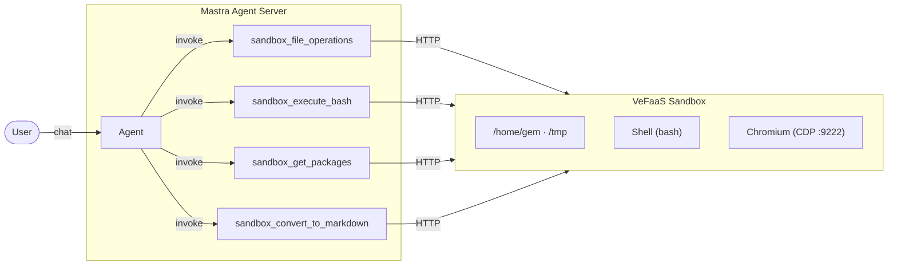

# Mastra Sandbox Agent

A general-purpose AI agent, running tasks inside a Volcengine VeFaaS sandbox.

> **Live Demo** — Try it instantly in [AIO Sandbox Playground](https://console.volcengine.com/vefaas/region:vefaas+cn-beijing/market/aio-sandbox)


> **Tip**: For more details about the All-in-one Sandbox API and MCP tools, refer to the [All-in-one Sandbox Documentation](https://sandbox.agent-infra.com/) and the [GitHub repository](https://github.com/agent-infra/sandbox).


## What It Does

- Receives user tasks via the [Mastra](https://mastra.ai/) agent interface
- Doubao Seed model plans the task and invokes sandbox tools
- Tools execute inside All-in-one sandbox (file system, shell, browser)



| Tool | Description |
|---|---|
| `sandbox_file_operations` | Read, write, replace, list, find, grep, glob |
| `sandbox_execute_bash` | Run shell commands with optional session state |
| `sandbox_get_packages` | List installed Python / Node.js packages |
| `sandbox_convert_to_markdown` | Convert URL, PDF, Word, or HTML to Markdown |

## Setup & Run

### 1. Install dependencies

```bash
pnpm install
```

### 2. Create a Sandbox application

If you don't have one yet, [create an All-in-one Sandbox application](https://console.volcengine.com/vefaas/region:vefaas+cn-beijing/sandbox/create?imageGroup=All-in-one&quickStart=true&projectName=default) in the VeFaaS console and note the **Function ID** and **Endpoint**.

> 📖 See the full [Prerequisites](../../README.md#2-prerequisites) guide for details.

### 3. Configure environment

```bash
cp .env.example .env
```

| Variable | Required | Description |
|---|---|---|
| `OPENAI_API_KEY` | Yes | ARK API key for Volcengine model |
| `SANDBOX_ENDPOINT` | Yes | HTTP endpoint of your VeFaaS sandbox function |
| `SANDBOX_APP_ID` | Yes | VeFaaS function ID (used to create sandbox) |
| `VOLC_ACCESS_KEY` | Yes | Volcengine Access Key ID |
| `VOLC_SECRET_KEY` | Yes | Volcengine Secret Key |
| `VEFAAS_REGION` | No | VeFaaS region (default: `cn-beijing`) |
### 4. Run

```bash
pnpm dev
```

Open [http://localhost:4111](http://localhost:4111) to access the Mastra Playground and start chatting with the agent.

> [!TIP]
> The default **Max Steps** is 5, which is too low for complex tasks. Go to **Model Settings → Advanced Settings → Max Steps** and set it to **50+** before running.

**Example prompts:**

```
Clone fastapi/fastapi 仓库，分析其目录结构、核心模块与主要编程语言构成，生成项目分析报告 report.md。
```

Uses `sandbox_execute_bash` to clone the repo and run shell commands, and executes code snippets to analyze language composition.

```
调研 github.com/badlogic/pi-mono，分析其核心特点。
```

Uses `sandbox_convert_to_markdown` to fetch and parse blog pages and linked papers/PDFs, and `sandbox_file_operations` to write the final report.

```
访问字节跳动 Seed 官方博客，识别最新技术动态，输出结构化调研报告。
```

Uses `sandbox_execute_bash` with [agent-browser](https://github.com/vercel-labs/agent-browser) (loaded via `SKILL.md`) for generalized browser interaction, combined with `sandbox_file_operations` and code execution to collect, compare, and write the analysis.

## Browser Automation

The agent uses [agent-browser](https://github.com/vercel-labs/agent-browser) for browser tasks. The sandbox has Chromium running with a CDP endpoint on port 9222. Skill documentation is at `skills/agent-browser/SKILL.md`.

## Reference

- [Mastra Documentation](https://mastra.ai/docs)
- [Volcengine ARK API](https://www.volcengine.com/product/ark)
- [Sandbox API Documentation](https://www.volcengine.com/docs/6662/1806654)
